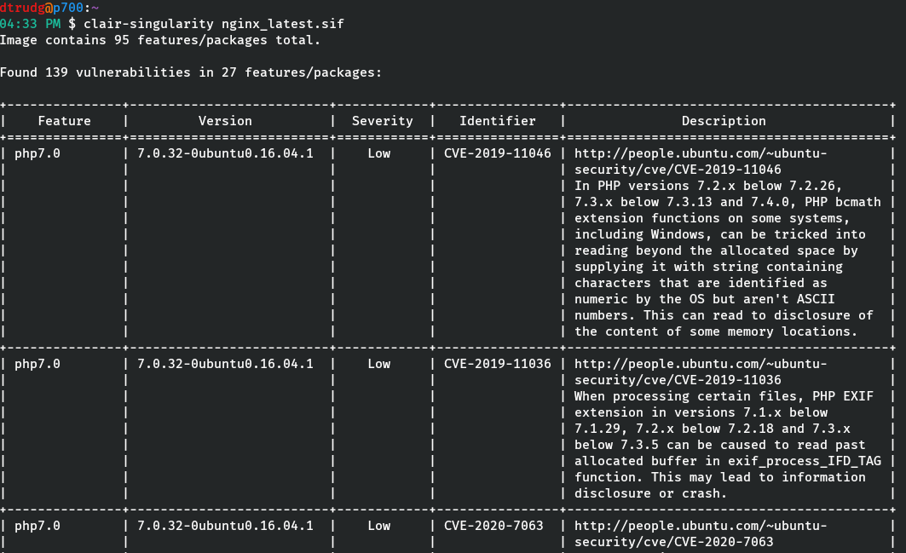

# clair-singularity

[](https://circleci.com/gh/dtrudg/clair-singularity/tree/master)

__Scan [Singularity](http://sylabs.io/singularity/) container images for
security vulnerabilities using [CoreOS
Clair](https://github.com/coreos/clair).__



The [CoreOS Clair vulnerability scanner](https://github.com/coreos/clair) is a
useful tool able to scan docker and other container formats for security
vulnerabilities. It obtains up-to-date lists of vulnerabilities for various
platforms (namespaces) from public databases.

We can use Clair to scan singularity containers, by exploiting the fact that an
exported .tar.gz of a singularity container image is similar to a single layer
docker image.

This tool:

* Exports a singularity image to a temporary .tar.gz file (this will be under
  `$TMPDIR`)
* Serves the .tar.gz file via an in-built http server, so the Clair service can
  retrieve it
* Calls the Clair API to ingest the .tar.gz file as a layer for analysis
* Calls the Clair API to retireve a vulnerability report for this layer
* Displays a simple text, or full JSON format report

Based on experiments detailed [in this
Gist](https://gist.github.com/dctrud/479797e5f48cfe39cdb4b50a15e4c567)

## IMPORTANT NOTES

Functionality was last tested using SingularityCE 3.9.7.

This tool should be considered proof of concept, not heavily tested. Use at your
own risk.

There is no support yet for SSL client certificates to verify that we are
sending API requests to a trusted Clair instance, or that only a trusted Clair
instance can retrieve images from the inbuilt http server. *This means that this
solution is insecure except with an isolated local install of Clair*.

## Requirements

To use clair-singularity you will need a *Linux* host with:

* Python 3.5 or greater installed
* SingularityCE 3+ installed (tested with 3.9.7) and the singularity
  executable in your `PATH`
* A Clair instance running somewhere, that is able to access the machine you
  will run clair-singularity on. It's easiest to accomplish this using docker to
  run a local Clair instance as below.

## Starting a local Clair instance

If you have docker available on your local machine, the easiest way to start
scanning your Singularity images is to fire up a Clair instance locally, with
docker. The official Clair docker images are a blank slate, and do not include
any vulnerability information. At startup Clair will have to download
vulnerability information from the internet, which can be quite slow. Images
from github user arminc are available that include pre-seeded databases:

<https://github.com/arminc/clair-local-scan>

To startup a Clair instance locally using these instances:

```bash
docker run -d --name db arminc/clair-db:2022-03-31
docker run -p 6060:6060 --link db:postgres -d --name clair arminc/clair-local-scan:v2.1.8_9bca9a9a7bce2fd2e84efcc98ab00c040177e258
```

*Replace the clair-db:2022-03-31 image tag with a later date for newer
vulnerabilities*

## Installation

Clone the git repo, or download and extract the zip then:

```bash
python setup.py install
```

## Usage

### Clair on same machine

To scan a singularity image, using a clair instance running under local docker,
on port 6060:

```bash
clair-singularity myimage.sif
```

/If your hostname is not resolvable to a non-localhost IP of your machine,
accessible to docker containers, you must specify the IP with `--bind-ip`/

### Clair on a different machine

If clair is running on a different machine, you must use the `--clair-uri`
option to specify the base URI to the clair instance, and the `--bind-ip` and/or
`--bind-port` options to specify a public IP and port on this machine, that
clair can access to retrieve images from `clair-singularity`.

```bash
clair-singularity \
 --clair-uri http://10.0.1.202:6060 \
 --bind-ip=10.0.1.201 \
 --bind-port=8088 myimage.img
```

### Full JSON Reports

By default, clair-singularity gives a simplified text report on STDOUT. To
obtain the full JSON report returned by Clair use the `--jsoon-output` option.

```bash
clair-singularity --json-output myimage.img
```
